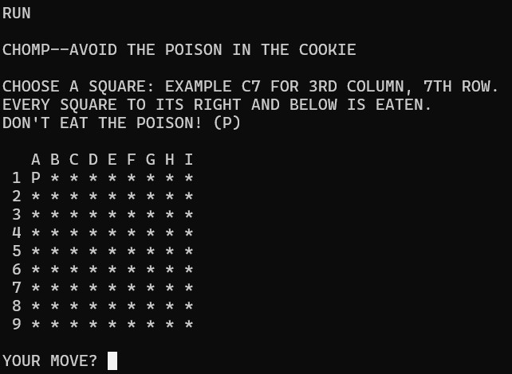

CHOMP: Classic "Chomp the Cookie" BASIC Game for Coco3
==========

CHOMP is a classic game from computing's early days.  You have a 9x9 square "cookie" with one
bit of poison in it.  Take turns taking a bite out of the cookie without eating the poison.

The computer strategy is not perfect.  I wonder what a good strategy would be.  The player goes
first, so it should be possible for the player to win every time.

`CHOMP.BAS` is the BASIC program to use; the other `chomp.bas` file is the source before
being run through my BASIC preprocessor utility, which is in another of my repositories.
